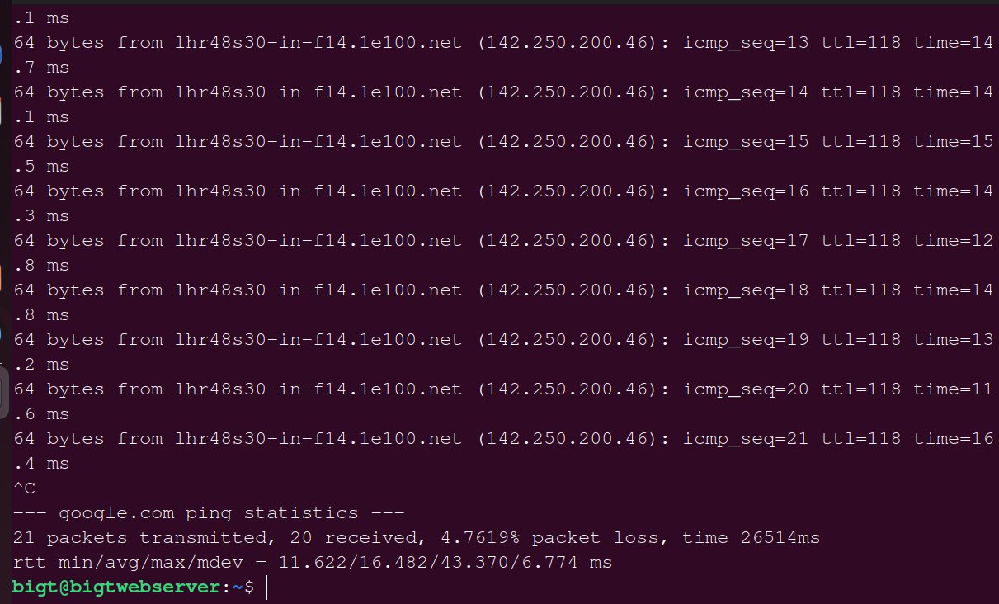

this is my project1 workflow

'sudo apt upgrade'

pwd cd ls cat

cp mv touch find and locate command

mkdir rmdir rm 

head and tail command

grep df du

chmod chown add psswd del psswd tree 

wget command bin file ping

su ps htop top hostname echo diff

