# AWS NETWORKING IMPLEMETATION (VPC SUBNETS IG NAT ROUTING)

## the aim of this project is to ensure hands-on expertise on aws networking .

### VPC:Virtual Private Cloud: this is an isolated enviroment in aws cloud infrastruction where a user can provision his resouces or aws services securely in a particular region.

### IG:internet gatway: this is the protocol that allow users/internet to access the the public subnets within the vpc and it always mounted on the vpc.

### NAT:Network Address Translation: its is usually mounted on the public subnet to allow outbound communication of the resources within the private subnet to communicate the internet safely. NAT gateway are of two types. Private and public (by defaut). upon provisioning a public NATGatway it is immedaitely associated to an elastic IP . this can also be used to connect your other vpcs or your o-premise network, in this case traffic is routed from the NATgateway via a transit gateway or a virtual private cloud. instances in private subnets can connect to other vpcs or your on-premise network via the private NATgateway, in this case traffic is routed fro the NATGATEWAY via transit gatewat or virtual private gateway. note you cant associate an elastic Ip with a private NATgateway.

### Transit gateway:this is the network transit hub that can be used to interconnect vpcs and on-premise network.It can also initiate connections among resources withn the vpc.

### SUBNETS: These are subdivisions within the vpc where resources are isolated for security and accessibility. there are two types . private and publice subnets. public subnet houses resources that can be access directly via the internet gatway by the user while private subnets houses resouces that can't be access by the internet. However, the resouces in this subnets can commmunicate to the internet through the NAT gateway

### ROUTING/ROUT TABLE:this contains a set of rules called routs that determins the flow of traffic from subnets or gatway

### security group: thisis a layer of security that controls the inbound and outbound traffic for the instance within a subnet

### NACLs(Network access control List) this ia a broader layer of security at the level of subnet to secure the instances within a subnet. it controls the inbound and outbound traffic of the subnet.

### VPC PEERING: this is a networking feartyre that allows connection of two vpcs within the same cloud providers network or accross differnt region. this enable communication between pvc allowing resources in each vpc to interacts with each othet as if they were on the same network. the only disadvantage of vpc peering is that its not scalable unlint transit gateway. vpc peering can only peer two vpc but transit gateway can peer or connect multiple vpc simultaneously.

### VPN(Virtual Private Cloud):this establishes a secure and encrypted communication channel between and on-premise network and a cloud providers network such as VPC. there are two types: Site-To-Site VPN and AWS Client VPN

## Step1 provisioning a vpc
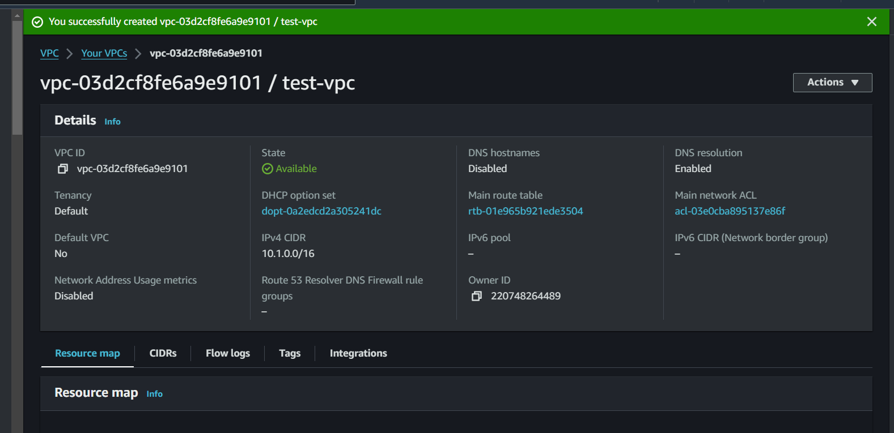

## step2 creating subnets

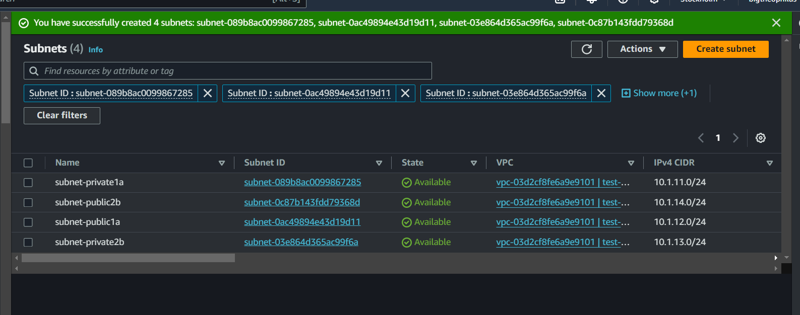

## Step 3 creation and attaching internet gatway to the vpc and associatint to the public subnets
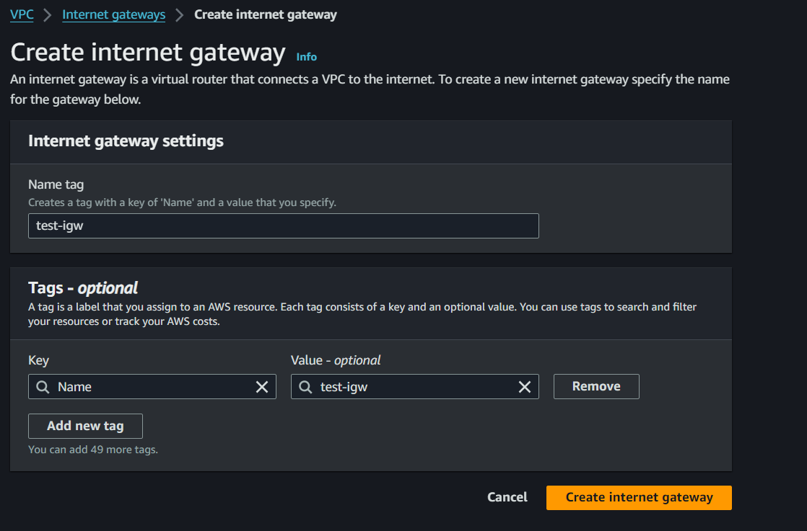
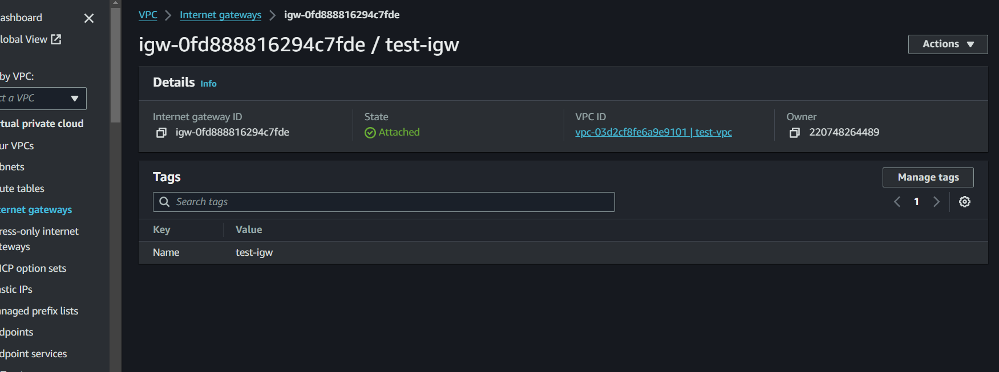

## Step4 creating rout table for the public subnets
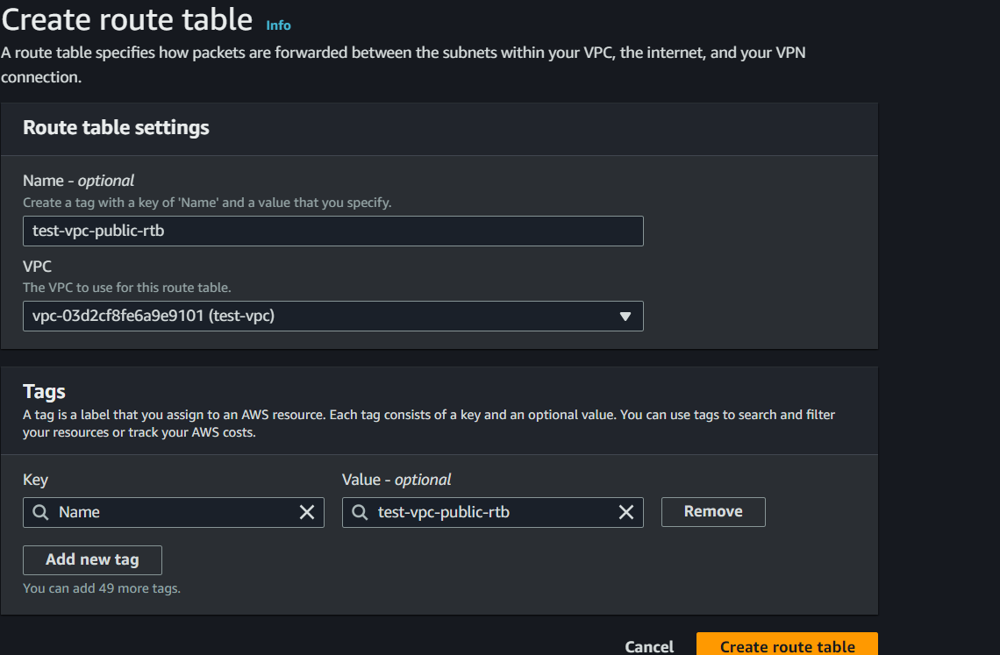
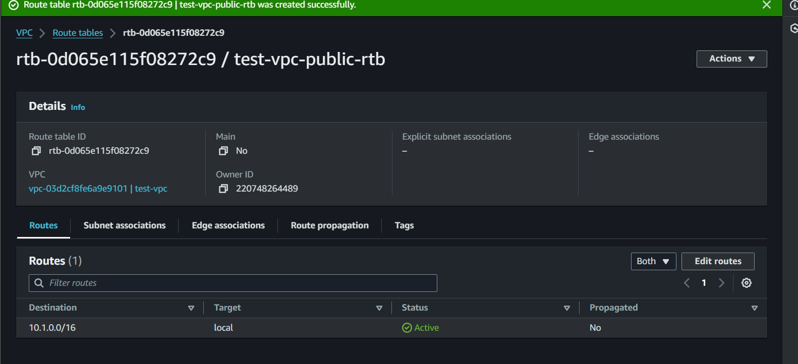

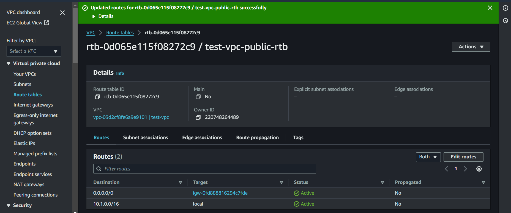

## Step5 created Natgateway and route table for the private subnet
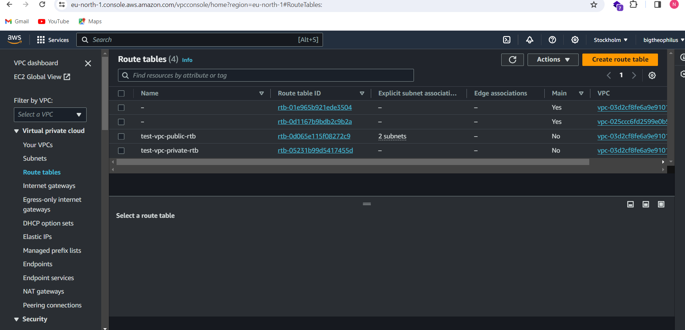
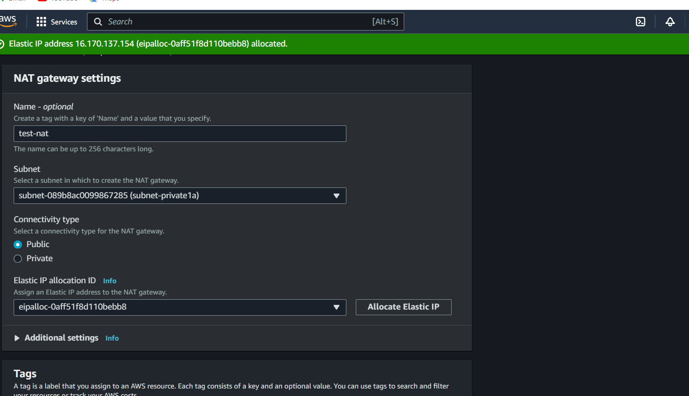

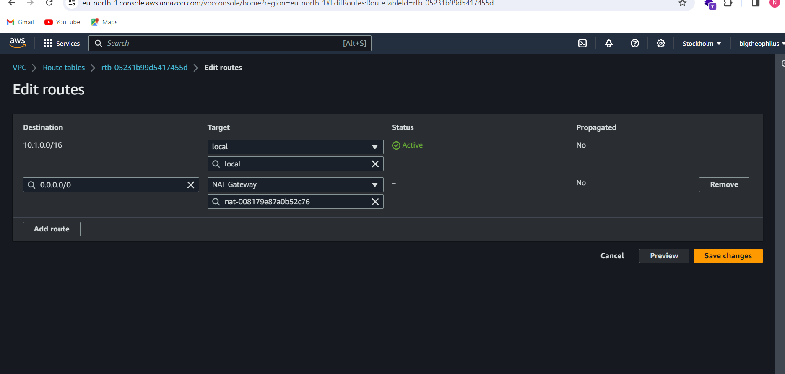

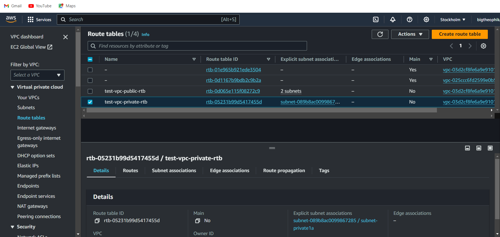

## Finally a view at the architecture/resources map
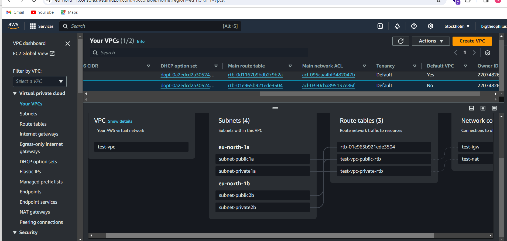

