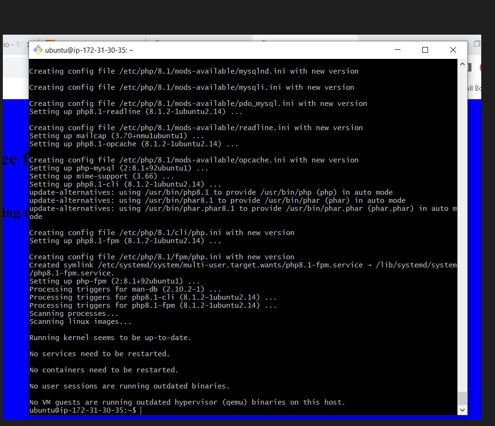
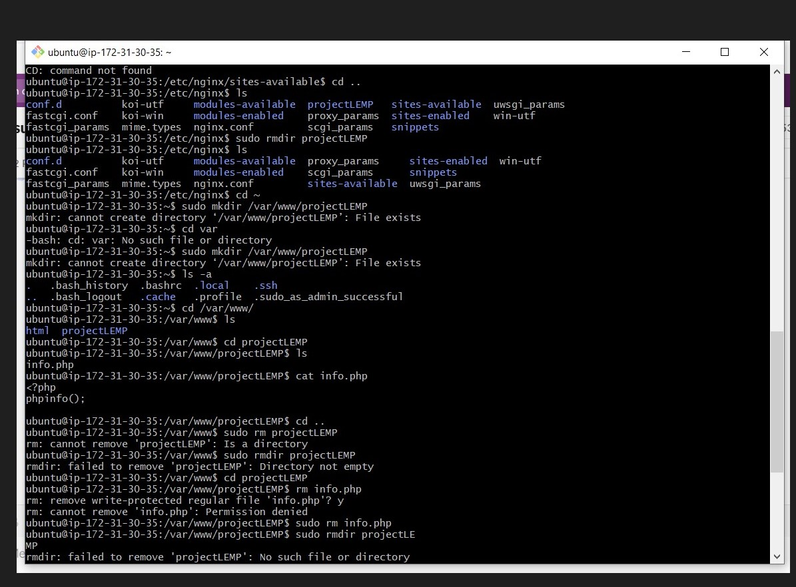
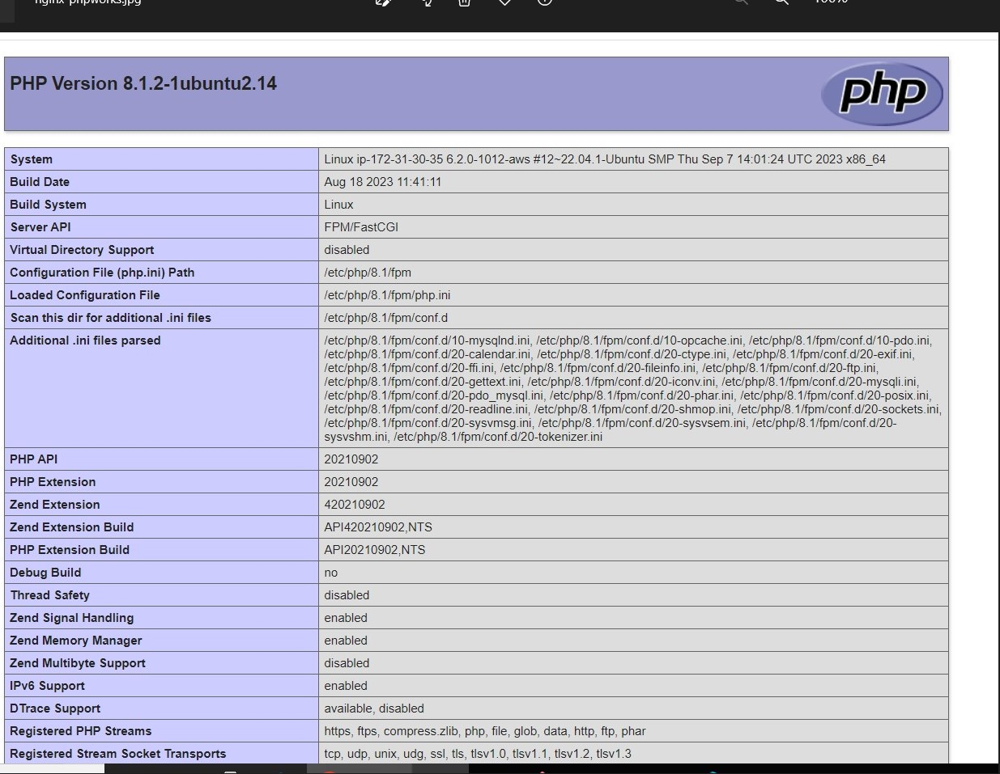

#WEB STACK IMPLEMENTATION (LEMP)

##Prerequisites

-log into my AWS account lunched an instance called "Nginx-server" with open port80 securty settings

-ssh to connect to the sever after cd into my Downloads on my bash interface

#STEP1 INSTALLING THE NGINX WEB SERVER

##comand ran.

`sudo apt update`

`sudo apt install nginx`

`sudo systemctl status nginx`

###accessing it in ubutu shell, i ran the curl command

`curl http://localhost:80`

`http://http://13.53.159.210:80`

#STEP2-INSTALLING MYSQL

 `sudo apt install mysql-server`

`sudo mysql`

`ALTER USER 'root'@'localhost' IDENTIFIED WITH mysql_native_password BY 'PassWord.1';`

`sudo mysql_secure_installation`

`sudo mysql -p`

`mysql> exit`

#STEP3-INSTALLING PHP

`sudo apt install php-fpm php-mysql`

##STEP4/5-CONFIGURING NGINX TO USE PHP PROCESSOR

`sudo mkdir /var/www/projectLEMP`

`sudo chown -R $USER:$USER /var/www/projectLEMP`

`sudo nano /etc/nginx/sites-available/projectLEMP`

`sudo ln -s /etc/nginx/sites-available/projectLEMP /etc/nginx/sites-enabled/`

`sudo nginx -t`

`sudo unlink /etc/nginx/sites-enabled/default`

`sudo systemctl reload nginx`

#STEP6-CREATING DATABASE USING MYSQL

`sudo mysql`

`mysql> CREATE DATABASE `example_database`;`

`mysql>  CREATE USER 'example_user'@'%' IDENTIFIED WITH mysql_native_password BY 'PassWord.1';`

`mysql> GRANT ALL ON example_database.* TO 'example_user'@'%';`

`mysql> exit`

`mysql -u example_user -p`

`mysql> SHOW DATABASES;`

`mysql> exit`

please i am open for corrections

