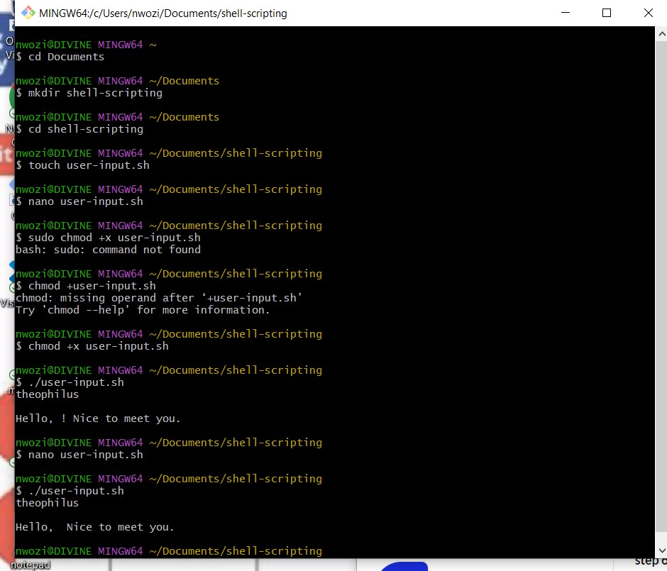

#SHELL SCRIPTING HANDS ON PROJECT

##Step1-created a folder called shell-scripting using mkdir command

`mkdir shell-scripting`

###step2 created a file called user-input.sh using the touch command

`touch user-input.sh`

###step3 copy and past the script using nano comand

`nano user-input.sh`

**save the file by ctrl X +Y Enter**

##step5 change the permission on the file to make executable using the chmod command

`chmod +x user-input.sh`

##step6 rand the script.

`./user-input.sh`

#DIRECTORY MANIPULATION AND NAVIGATION

##step1 opened a file called navigating-linux-filesystem.sh using touch command

`touch navigating-linux-filesystem.sh` 

##step2 edited the the file withe the script using nano command

`nano navigating-linux-filesystem.sh` 

**saved the filr with ctrl X and Y Enter**

##step3 make the file executable using the chmod command

`chmod +x navigating-linux-filesystem.sh`

##step4 execute the file.

`./navigating-linux-filesystem.sh`

#FILE OPERATION AND SORTING

##ste1 created a file called sorting.sh using the touch command

`touch sorting.sh`

##Step2 edited the file to sript in the codes using nano

nano sorting.sh

**save file using ctrl X  and Y and enter**

##step3 make the file executable using the chmod command

`chmod +x sorting.sh`

##step4 file executed.

#WORKING WITH NUMBERS AND CALCULATION

##step1 created a file called 'calculation.sh' using the touch command

`touch calculation.sh`

##step2 edit the file using nano to scrit the codes

`nano calculation.sh`

**save the file using ctrl+ X then Y enter**

##step3 made the file executable by changing the permission 

`chmod +x calculation.sh`

##step4 executed the file

`./calculation.sh`

#FILE BACKUP AND TIMESTAMPING

##Step1 created a file called backup.sh using touch command

`touch backup.sh`

##Step2 made the file executable by using the chmod command

`chmod +x backup.sh`

##step3 edit the file using nano command

`nano backup.sh`

**save the file with ctrl +X then Y enter**

##Step4 execute the file

`./backup.sh`

