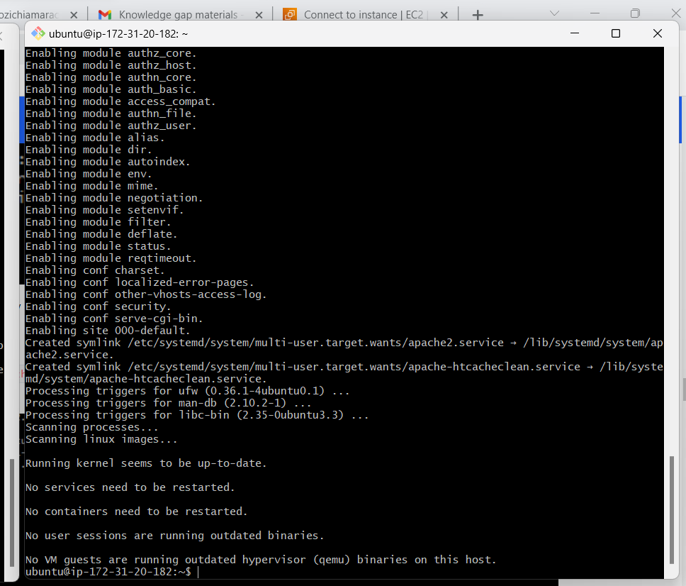

# SETTING UP A BASIC LOAD BALANCER

## Step1 provisioning 3 instances 
### two have apache2 installed in them and the other Nginx

### port 8000 is open on the apache2 servers and set to allow traffic everywhere, while port 80 is open on the nginx server.....

## Step2 Install apache2 into the servers

### ssh into the servers to connect on the command line

### update and install apache2

### confirm that apache2 is active and running in the two servers.......

`sudo apt update -y &&  sudo apt install apache2 -y`

`sudo systemctl status apache2`

## Step3 Apache2 configuration

### configured apache2 to server content on port 8000. this was done by adding 8000 to the already existen listen port 80

`sudo nano /etc/apache2/ports.conf` 

### effect the change on the default file on site-available

`sudo nano /etc/apache2/sites-available/000-default.conf`

### saved changes and restarted apache2 server

`sudo systemctl restart apache2`

### created a new file index.html amd posted the code in it 'welcome to my EC2 public ip'.

`sudo nano index.html`
 

### changed the file ownership

`sudo chown www-data:www-data ./index.html`

### copy cotent into the default file on html dirrectory to overide it

`sudo cp -f ./index.html /var/www/html/index.html`

### then restarted apache2 on bothe servers

`sudo systemctl restart apache2`

### paste the public IP of my servers on the tab to desplay my content page

## Step4 working on the load balancer

### ssh into the server

### update and install nginx 

`sudo apt update -y && sudo apt install nginx -y`

### verified that nginx is active and running

`sudo systemctl status nginx`

### configure nginx by injecting the public IPs of my apache2 servers into the upstream backed block, then that of my load balancer as well.

`sudo nano /etc/nginx/conf.d/loadbalancer.conf`

### tested and restarted nginx load balance

`sudo nginx -t`

`sudo systemctl restart nginx`

### papsted the public IP of my load balance on the tab and desplayed my servers web pages after reloading

NOTE: initially i had a 504 gate way error and i discovered it was because i lunched the tree instance with same security group. This affected the inbound rules editng. however i had to delete the nginx instance and lunched another with a new security group. 

