# AUTOMATING LOAD BALANCING THROUGH SHELL SCRIPTING

# Step1:provision two ubuntu based servers nameed server1 amd server2.

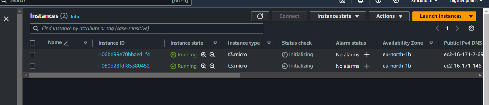

## set the inbound rules to listen at port 8000 everywher
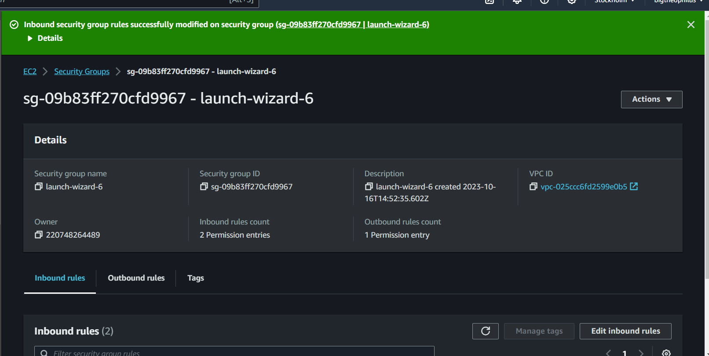

## ssh into the servers via the gitbash channel

## created a file called install.sh and pasted the codes

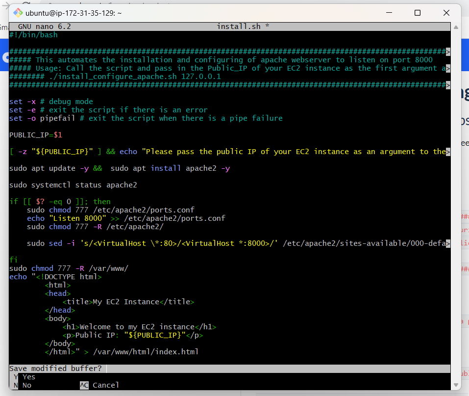

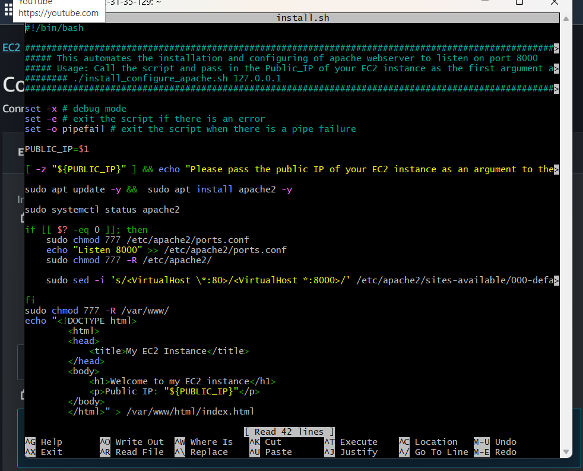

## saved and changed mode to make the file executable;

`sudo nano install.sh`

`sudo chmod+x install.sh`

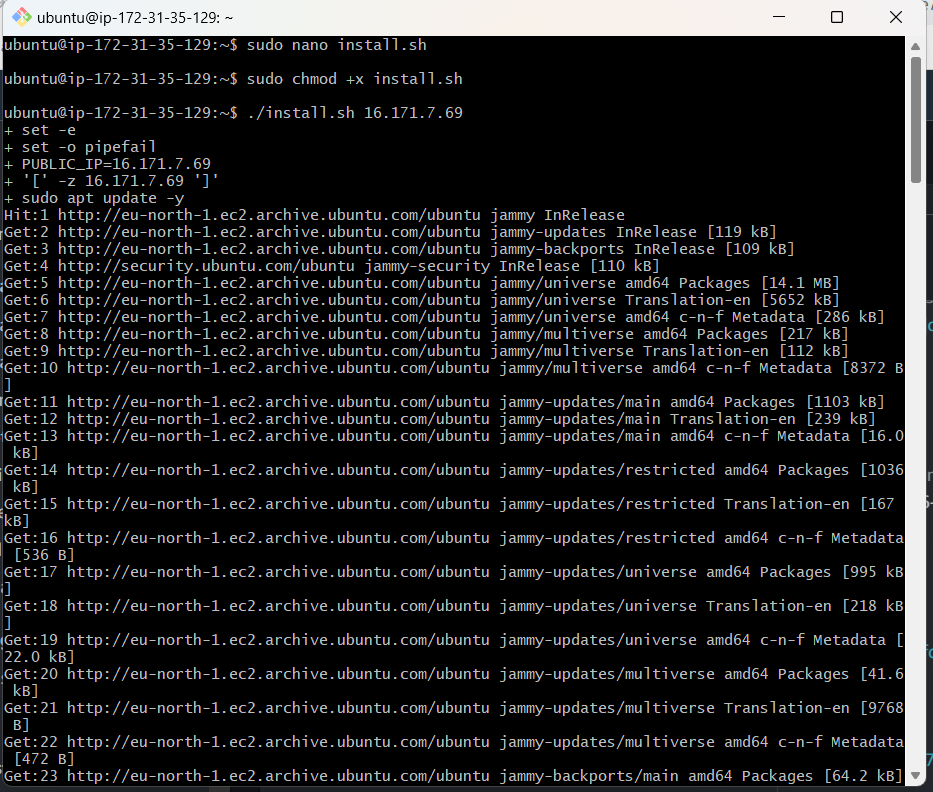

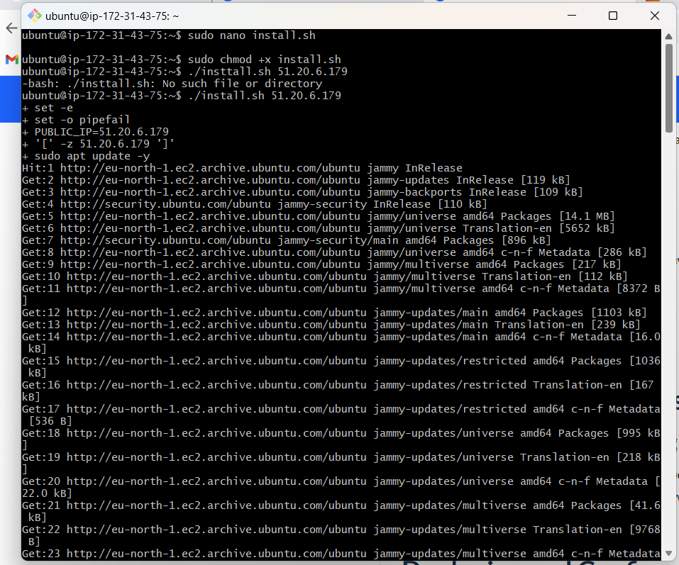

## ran and executed the file succefully:

./install.sh 16.170.232.173

./install.sh  51.20.6.179

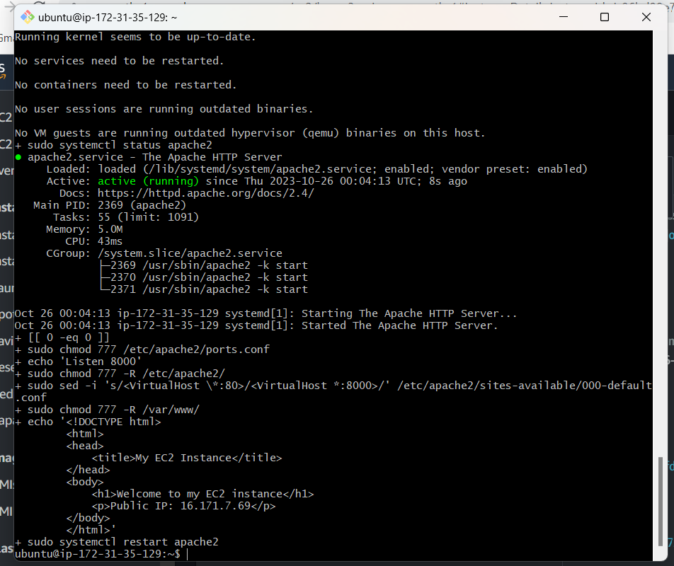

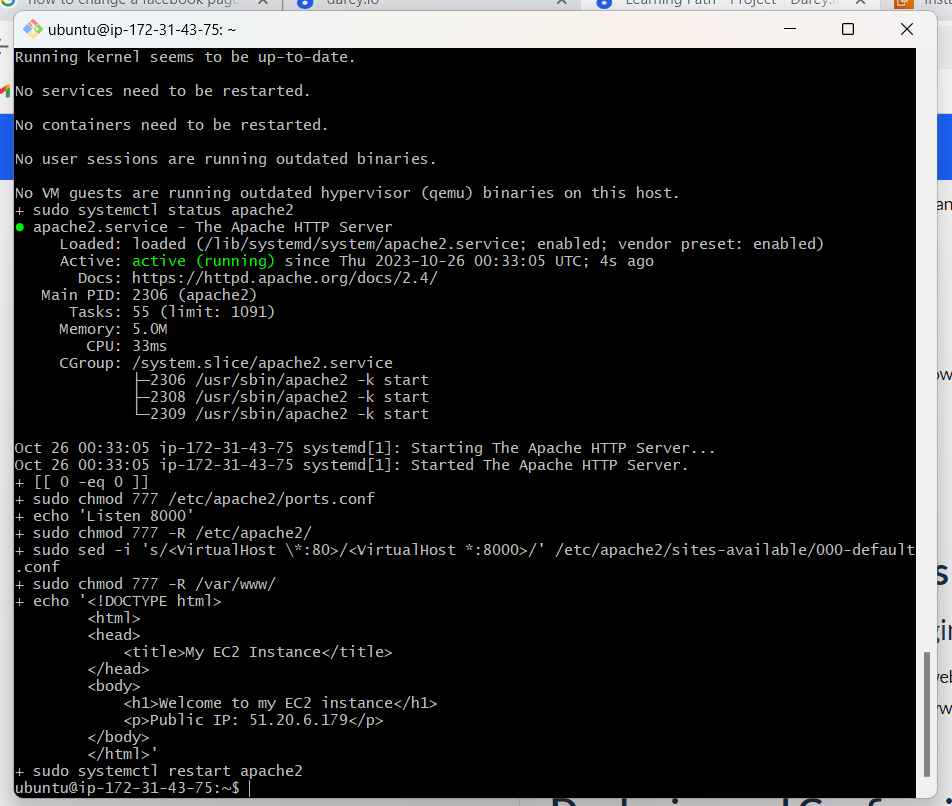

## pasted the public IP of the server on the web to check if it works

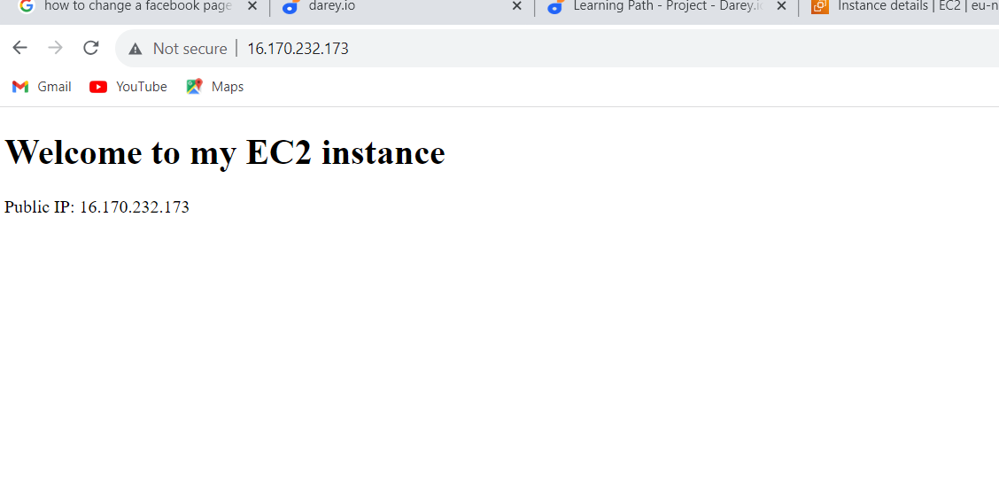
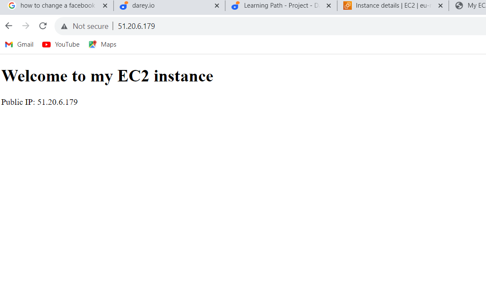

# Step2 setting up the Nginx load balancer serever as follows:

## provision a server name Nginx-load-balancer
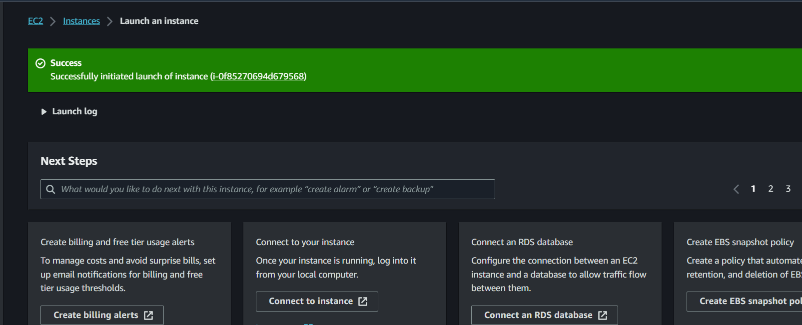

## sett the inbound rules to port 80 everywher
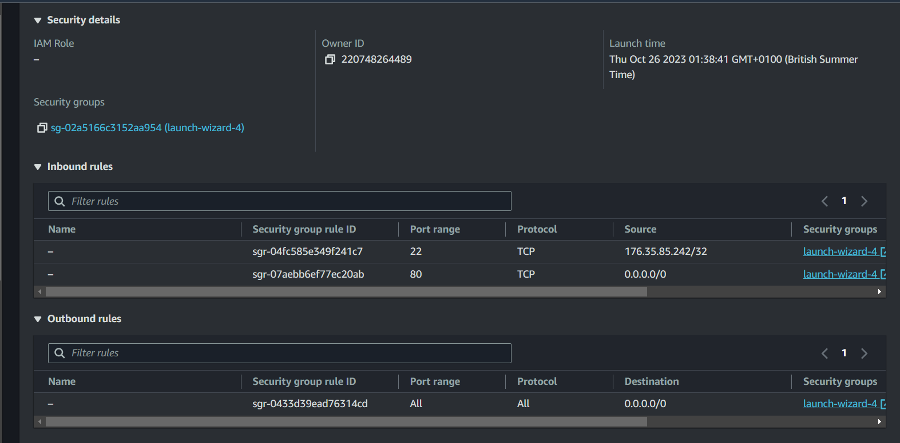

## ssh into the server via git bash CLI

## created a file called 'nginx.sh' and pasted the code

`sudo nano nginx.sh`

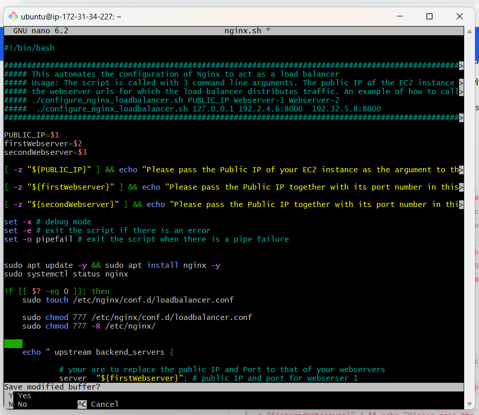

## file saved and changed mode to make it executable

`sudo chmod +x nginx.sh`
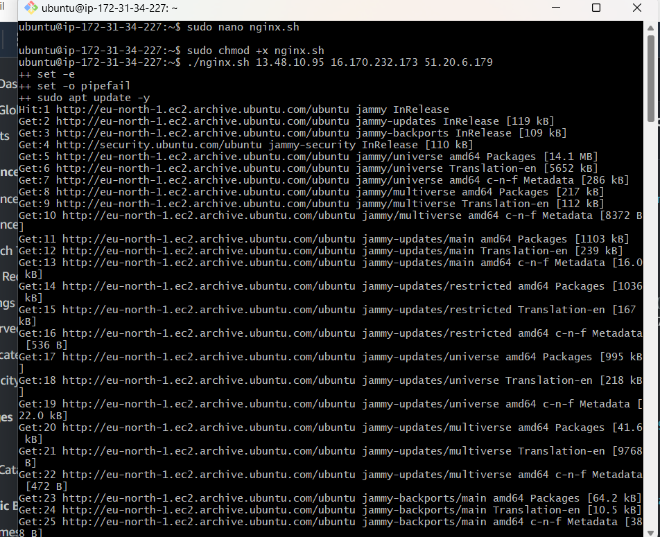

## executed the nginx.sh file with its public IP, server1 and server2 public IPs

`./nginx.sh 13.48.10.95 16.170.232.173 51.20.6.179`

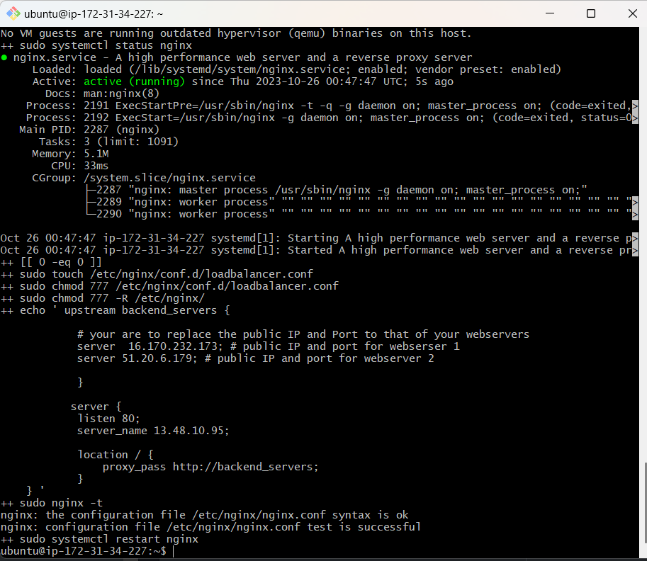

## pasted the nginx IP on the web and it didplayed the server one page and when refreeshed server2 and so on . this showed that nginx worked succesfully as a load balacer to distribute the traffic 

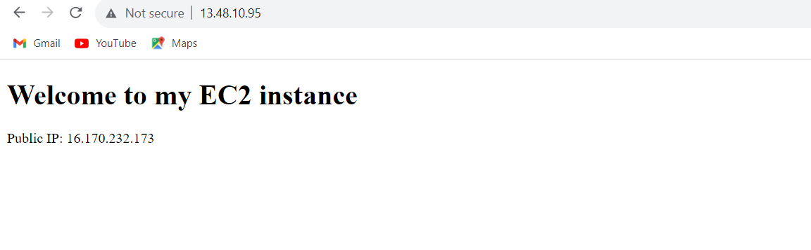

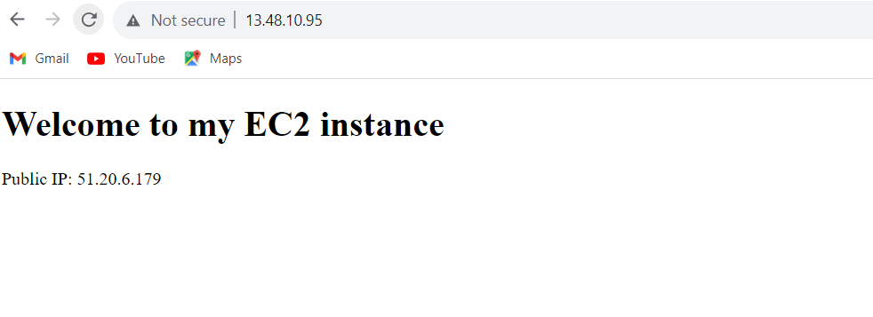
