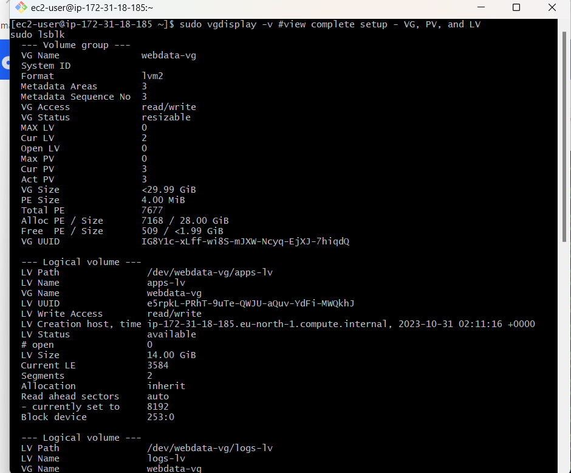

# Implementing Wordpess Website With LVM Storage Management

# STEP 1

## lunched a redheart webserver
## created volumes and attached the volumes to the server disk
## ssh into the server and created partitions for each of the ceated volumes

`sudo gdisk /dev/volume-name`

# STEP2 

## installed LVM2 by 

`sudo yum install LVM2 -y` 

## used the 'pvcreate' utility to create physical volumes for each of the attached volumes and confirm the created physical volumes 

`sudo pvcreate /dev/volume-name`

`sudo pvs`

## used the 'vgcreate' to add all the 3 physical volumes to a group called webdata-vg

`sudo vgcreate webdata-vg /dev/pv1/pv2/pv3`

## verified using 

`sudo vgs`

## used the 'lvcreate' utility to create two logical volumes one for apps "Apps.lv and the other for logs "log-lv" and verify the succesful creation of these lv

`sudo lvcreate -n apps-lv -L 14G webdata-vg`
`sudo lvcreate -n logs-lv -L 14G webdata-vg`
`sudo lvs`

## verified the entire setup

`sudo vgdisplay -v #view complete setup - VG, PV, and LV`
`sudo lsblk` 

## formated the lv with mkfs.ext4 utility

`sudo mkfs -t ext4 /dev/webdata-vg/apps-lv`
`sudo mkfs -t ext4 /dev/webdata-vg/logs-lv`

# STEP3

## Created the /var/ directory and the /home/ directory and then mount the app-lv on the /var/www/html directory and the logs-lv on the /var/log directory

`sudo mkdir -p /var/www/html`
`sudo mkdir -p /home/recovery/logs`
sudo mount /dev/webdata-vg/apps-lv /var/www/html/
sudo rsync -av /var/log/. /home/recovery/logs/
sudo mount /dev/webdata-vg/logs-lv /var/log

## confirm the uuid

 ## updated the file

# STEP4

## installed wordpress on the server, wget httpd and all its dependencies

`sudo yum update -y`
`sudo yum install wget httpd php php-myslqnd php-fpm php-json`
`sudo systemctl enable httpd`
`sudo systemctl start httpd`

## installed PHP and its dependencies then download wordpress and copy to /var/www/html directory.

NOte:this was done by writing a script and running to carry out the command at once

## config SELinux-policies

## installed mysql-client in the websever in order to help communicate with my DB-webserver

`sudo yum install mysql -y`

# ON THE DATABASE SERVER THE STEPS WERE REPEATED TO CREATE VOLUMES, ATTACHED VOLUMES PARTITION VOLUMES CREATE PHYSICAL VOLUMS AND GROUP THEM IN A GROUPVOLUME AND INSTALL LVM2 AND CREATE TWO LOGICAL VOLUMES THIS TIME THE "APP-LV" now "DB-LV" MOUNTED ON THE /db/ DIRECTORY CREATED AS AGAINST THE /var/www/html DIRECTORY.
## installed mysql on the db-server and configureed to listen @ port 3306 created a user called 'myuser' ans password called 'mypass'

## connected to my DB-server via the mysql-client on the webserver and showdatabases

## configured the wp-config.php on the /var/www/html/wordpress directory and imputed my DB credentials

## pasted the public_IP of my webserver on my browser to populate the wordpress installation-page and imputed datas and require and continued to the welcome page.

