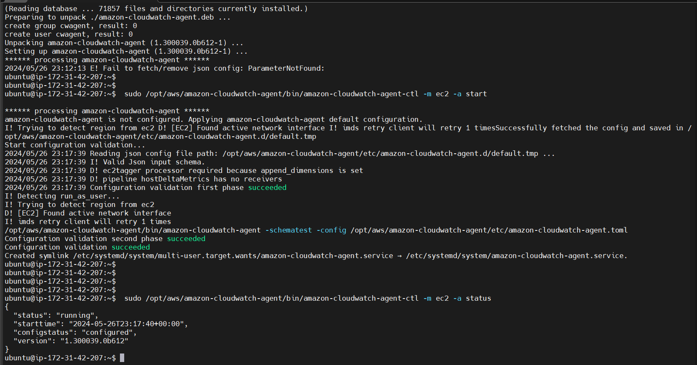

# CONFIGURING AWS CLOUDWATCH TO MONITOR EC2 LOGS

monitoring aws infractracture is very key as to know the logs, activity and security.
hence cloundwatch is a the aws resource that can provide this service. hence the aime of the project is to
configure cloundwatch to monitor EC2 so in the course of the project, a role will be created and policies attached to 
the role amd then a paramental will be created and the role attached to the EC2 for effective communication of the cloudwatch to 
the EC2.

### STEP1 ROLE CREATION

navigate to the iam console

in the IAM console navigate cliked on roles abd create a role 

add or selceted awscloudwatchfullaccess and ssmfullacces

### STEP2 CREATE PARAMETER IN THE SYSTEM MANAGER: the need for this to select the or define the metrics to be monitored.

navigated to the system monitor and select parameter store and create a parameter

in the scripts pasted in indicates that instanceID
mem and disk percentage used are to be monitored

### STEP3 PROVISIONED EC2

after provision the ec2 first i updated the machine, then installed unzip as the file for the cloudwatch agent to be installed in the machine is a ziped file.
the role is attached to the EC2 and this help to give permission for the cloudwatch to monitor the EC2 resource.
then ran the script and then start the agent and confirm its running .

`sudo apt update`

`sudo apt install unzip`

`sudo nano script.sh`

sudo chmod +x script.sh

`./script.sh`

`sudo /opt/aws/amazon-cloudwatch-agent/bin/amazon-cloudwatch-agent-ctl -m ec2 -a start`

`sudo /opt/aws/amazon-cloudwatch-agent/bin/amazon-cloudwatch-agent-ctl -m ec2 -a status`

##### after this i installed unzip on the machine so that when the scritp is ran there will 
be no issues 
#### note if unzip is not install there will be error.

### STEP4 CLOUDWATCH CONSOLE TO MONITOR THE EC2 METRIC

All metrics was selected and cloudwatch agent selected and all the parameters monitored.

