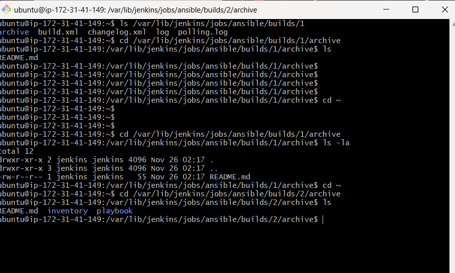

# ANSIBLE-AUTOMATE PROJECTION

## AIM
## the purpose of this project is to automate the management of servers such as webservers, db-servers, LB-servers from a single server called the controller or bastion Host or Jumper server via the use of ansible playbook 

# Step1 PROVISIONING SERVERS AND INSTALLING APPLICATIONS 
## provisioned an ec2 of ubuntu and named it ansible-jenkins opened port 22 and 8080 as ansible and jenkins were install in it.....this served as the controller.
## configure jenkins for a job on git repo

## created a repo on github named ansible-config-mgt and added a webhook with the url of my jenkins application added to it in other to beable to connect and triger saving of my artifacts

# Step2 SETTING UP MY VSCODE WORKSPACE

## git clone my repo to my vscode workspace

`git clone https://github.com/bigtheophilus/ansible-config-mgt`

# Step3 BEGIN ANSIBLE DEVELOPMENT

## created new branch named dev

## created new directories named playbook and inventory on the repo via vscode

## within the playbook a file name common.yml was crated and within inventory the following file was created:dev.yml, staging.yml prod.yml uat.yml

# Step4 CONFIGURATIONS

## all the host servers to be managed private ips where grouped and saved in the inventory/dev.yml file

## connected the host severs via the ssh agent from the bastion server

# Step5 CREATING PLAYBOOK

## copied the codes in the the playbook/common.yml file for instruction and git add. commit and push it then merge it to the main branch and confirmed the artifacts are saved in jenkins

# Step6 RUN FIRST PLAYBOOK

## Ran the playbook but first git clone my repo into my bastion server then cd into the andsible-config-mgt directory and git pull to bringdown the lates changes in my repo into the server and the ran the playbook successfully. confirmed wireshark installed

`ansible-playbook -i inventory/dev.yml playbook/common.yml`

# Step7 REPEAT PLAYBOOK WITH DIFFERENT CODES

## i repeated the playbook run by making a folder named 'ansible-testing' on the home directory and a file named 'testing' inside the directory and confirmed this path on the target hostserver

### i must say it was overwhelming but it was a success