# IMPLEMENTAT A CLIENT SERVER ARCHITECTURE USING MYSQL DATABASE MANAGEMENT SYSTEM 

## STEP1- creaated and configure two linux-based virtual servers on my EC2-AWS account, named one mysqlserver and the other mysqlclient.

### changed the inbound rules and opened port 3306 for the private ip of the myslqclient 

### ssh into the mysqlserver and install mysql-server software in it using;

`sudo apt install mysql-server`

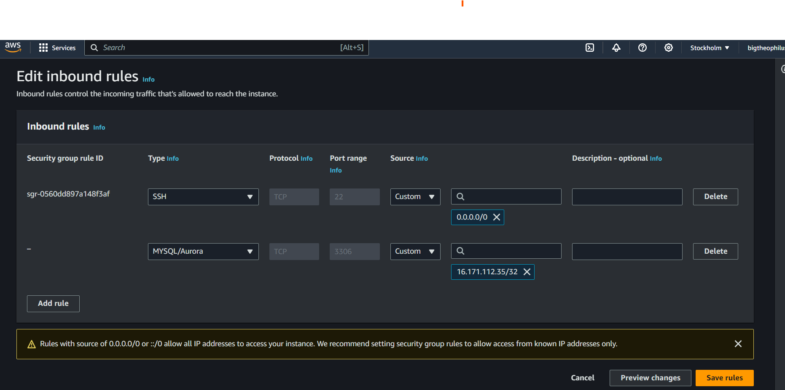
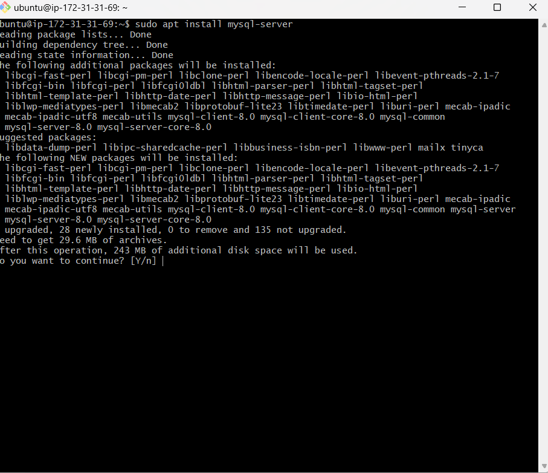
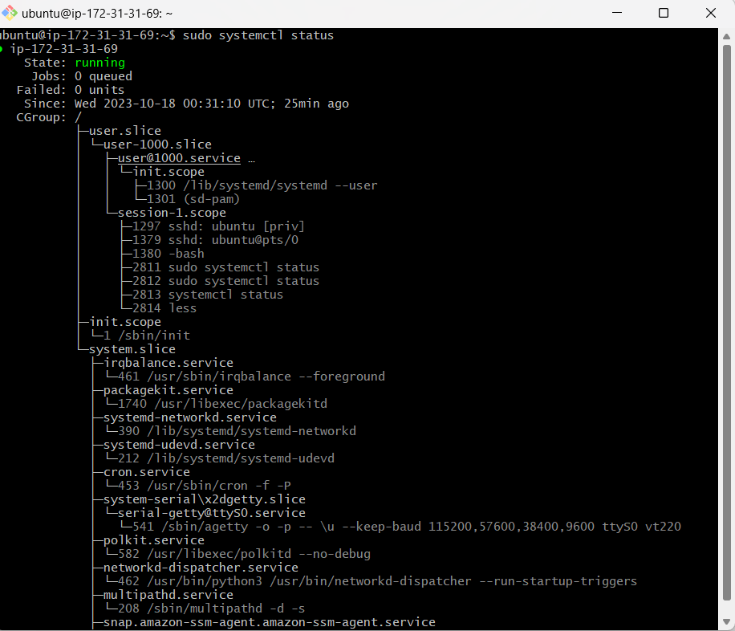

## STEP2-configured mysqlserver by making the binding site opened, restarted mysqlserver and log into mysql:

`sudo nano /etc/mysql/mysql.conf.d/mysqld.cnf` 

`sudo systemctl restart mysql.service`

`sudo mysql`

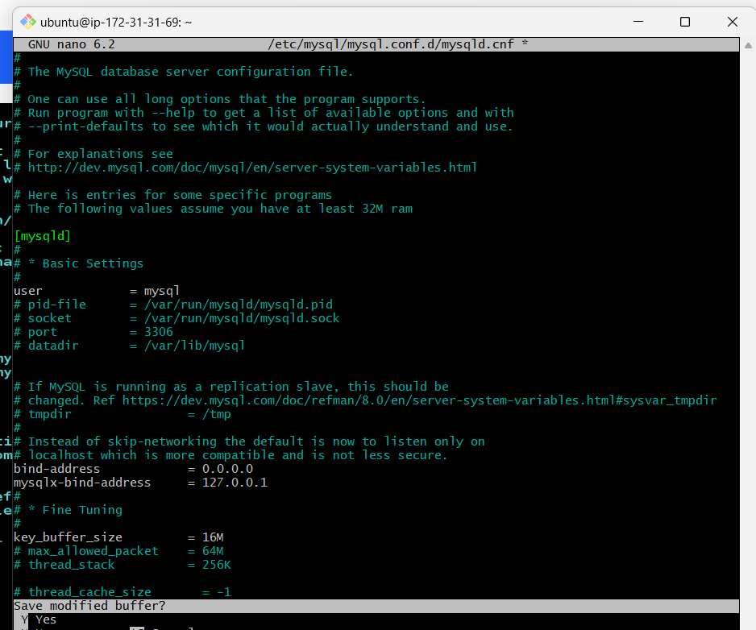
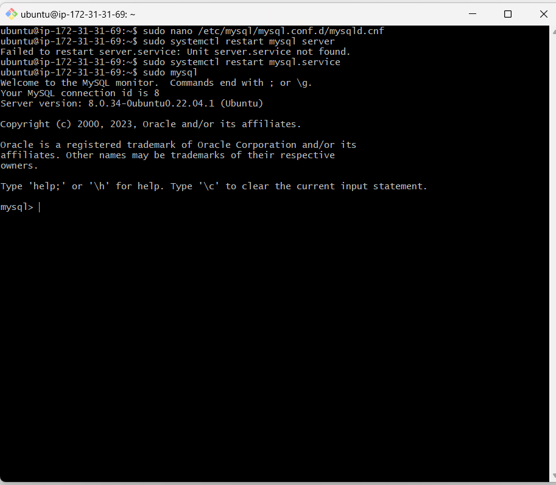

## STEP3-created a user called 'divine' and set password and privileges to the user, checked for available users and then created a database called 'amarachi' and show datat base

.. Noted that i have to drope one of the user as it was created on a public ip host instead of private ip ..

`CREATE USER 'divine'@'172.31.24.95' identified by 'bigamaT@2019;`

`grant all privileges on *.* TO 'divine'@'172.31.24.95';`

`CREATE DATABASE amarachi;`

`SHOW DATABASES;`

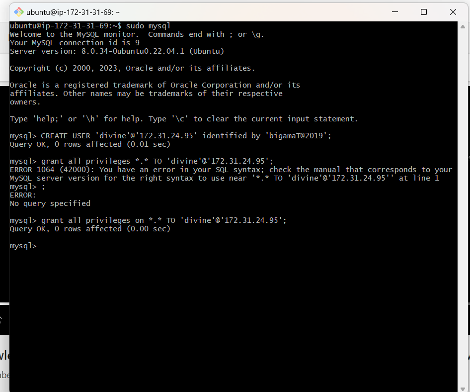
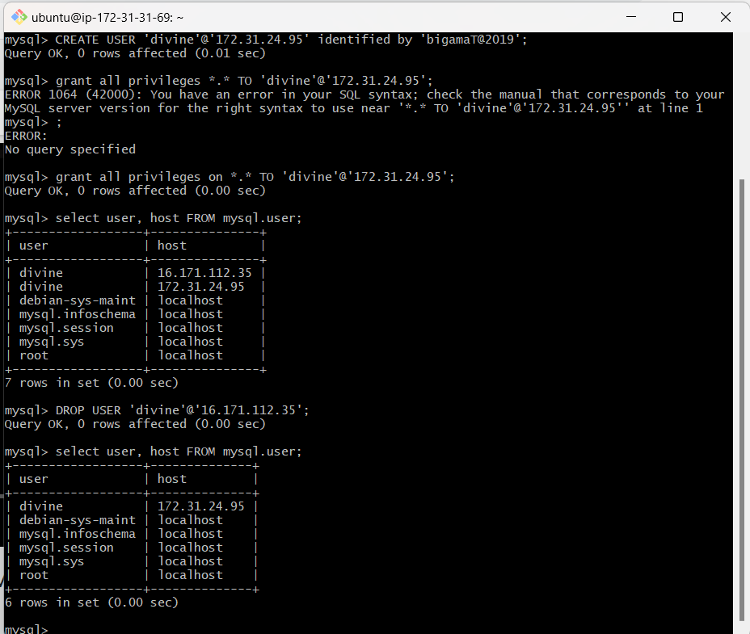
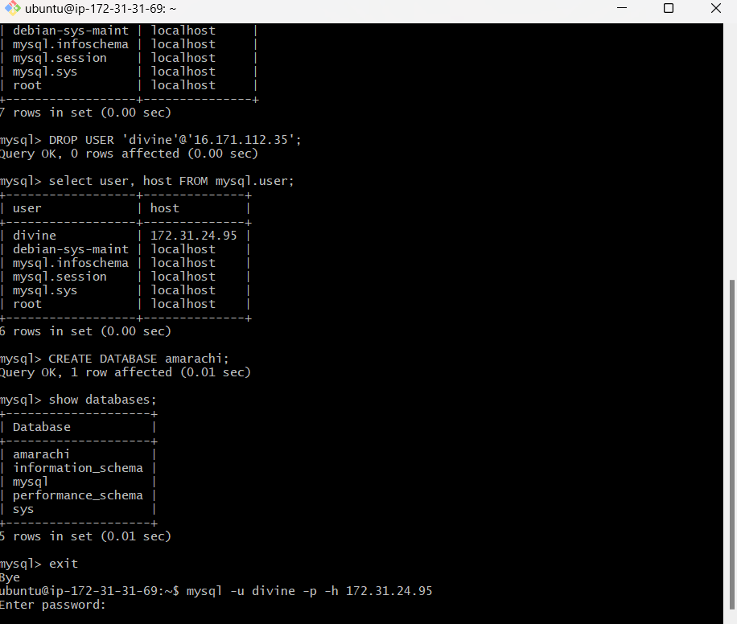

## STEP4-went to install mysql-client software on the mysqlcient server

`sudo apt install mysql-client`

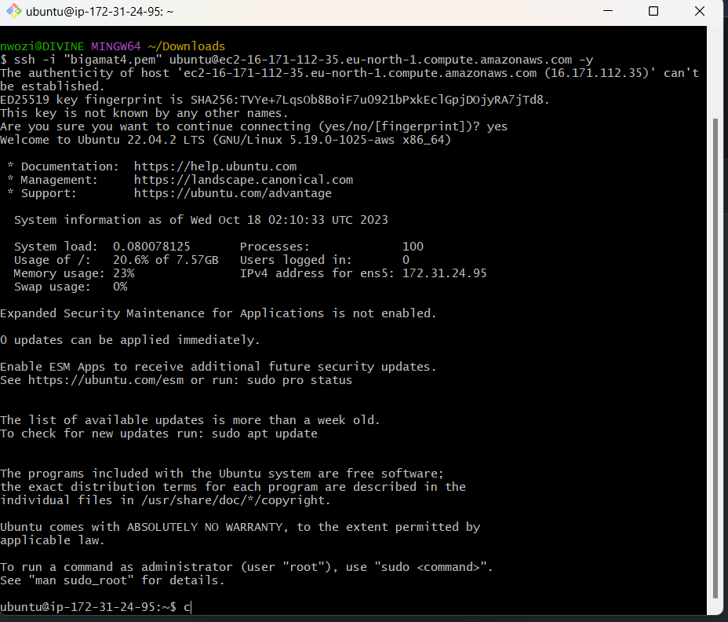
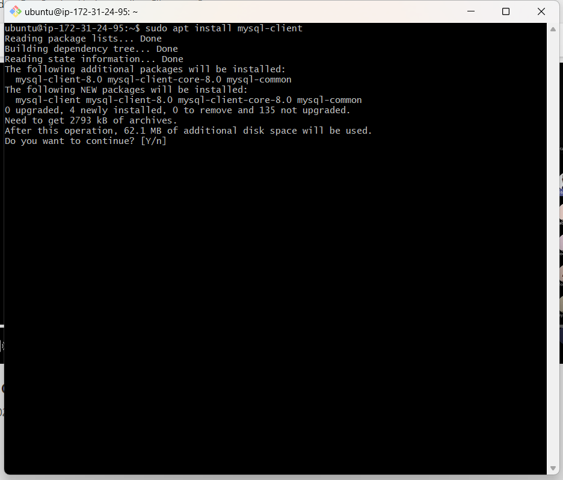
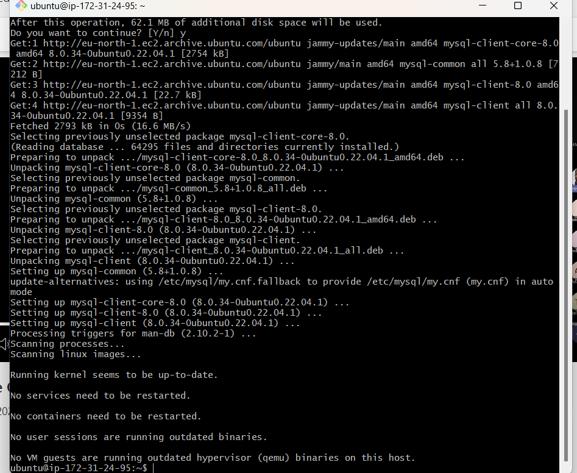

## STEP5- i connected my databases in my mysqlserver via the mysqlclient interface using my password and the private ip of mysqlserver.

